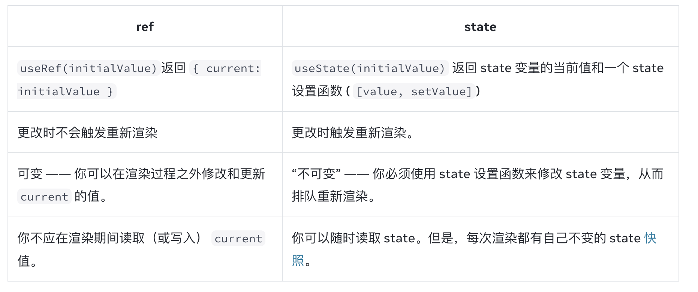

**目录**
- [**React 如何知道返回哪个state**](#react-如何知道返回哪个state)
- [**React 组件通信**](#react-组件通信)
- [**setState 为什么是异步的**](#setstate-为什么是异步的)
- [**ReactHooks**](#reacthooks)
  - [*useEffect*](#useeffect)
  - [*useCallback*](#usecallback)
  - [*useMemo*](#usememo)
  - [*useReducer*](#usereducer)
  - [*useRef*](#useref)
  - [*useReducer 和 useState 对比*](#usereducer-和-usestate-对比)
- [**Fiber - Reconciliation**](#fiber---reconciliation)
- [**React事件机制**](#react事件机制)

---------------------------------------------------------------------------------------------------------------------

## **React 如何知道返回哪个state**
在同一组件的每次渲染中，Hooks 都依托于一个稳定的调用顺序。这在实践中很有效，因为如果你遵循上面的规则（“只在顶层调用 Hooks”），Hooks 将始终以相同的顺序被调用。此外，linter 插件也可以捕获大多数错误。

在 React 内部，为每个组件保存了一个数组，其中每一项都是一个 state 对。它维护当前 state 对的索引值，在渲染之前将其设置为 “0”。每次调用 useState 时，React 都会为你提供一个 state 对并增加索引值。

## **React 组件通信**
1、状态提升，2个或者多个组件共享的state抽离放到最近公共父组件中。
2、使用context深层传递参数
3、redux 集中状态管理

## **setState 为什么是异步的**
调用setState，组件的状态不会立刻改变，而是会把要修改的状态放入一个任务队列中，等事件循环结束时将多次更新合并执行。
#setState异步更新的原因：
1、state 的更新是异步的。一方面对于频繁的更新渲染会影响效率，另一方面对于交互来说短时间内多次变更的很多中间状态是没有必要的，并不利于交互体验。
3、异步更新支持state在幕后渲染页面，这样旧的页面依然可以进行交互，当新的页面渲染好后可以做到无缝切换

## **ReactHooks**
通过useState编写Hooks，自定义Hooks命名必须是使用use开头小驼峰命名。

### *useEffect*

useEffect 接收一个函数，和一个数组，数组中变量改变的时候才会触发执行函数。如果没有第二个参数，则每次渲染副作用函数都会执行，如果数组为空，只有第一次渲染会执行。数组可以包含多个依赖，任意一个改变都会出发函数执行，React使用Object.is来比较对数组依赖进行比较的

useEffect 返回一个清理函数 React下一次执行Effect函数前执行清理函数，并在unmount前执行最后一次。开发环境下Effect函数会执行两次，React会多执行一次来检查代码有没有bug。生产环境下之执行一次。

所有在组件内部生命的变量都是reactive的。（All values inside the component (including props, state, and variables in your component’s body) are reactive. Any reactive value can change on a re-render, so you need to include reactive values as Effect’s dependencies.A mutable value like location.pathname can’t be a dependency.）

react rendering过程应该是对于jsx的纯计算过程，不应该操作dom元素。因为在这个过程中dom元素并不存在。对于dom元素的操作应该放大useEffect副作用中处理。
Effect 在渲染之后执行，所以如果在useEffect中修改state会陷入死循环。Effects run as a result of rendering

### *useCallback*
 
useCallback 用来缓存函数，接收两个参数。一个函数定义、依赖项；返回一个函数。首次渲染会返回一个函数，并缓存它，在后续渲染过程中如果依赖项没有改变，每次返回已经存储的函数。

在js中函数定义每次都会创建一个新的函数。（In JavaScript, a function () {} or () => {} always creates a different function）。
*使用场景*
1、当使用useMemo缓存组件的时候，如果父组件将函数传入需要缓存的组件，会因为每次都是一个新的函数而导致组件不断重新渲染，所以需要使用useCallback来缓存函数，确保传给组件的是同一个函数。
2、使用一个函数作为其他hooks的依赖的时候。
[Note that useCallback does not prevent creating the function. You’re always creating a function (and that’s fine!), but React ignores it and gives you back a cached function if nothing changed.]

### *useMemo*
useMemo 用来缓存函数执行结果，用来缓存组件。传入的函数应该是纯函数，并且不接收任何参数。
*使用场景*
1、函数计算复杂（有很长的循环处理），依赖改变比较少。
2、函数结果作为props传递给memo包裹的组件，可以通过useMemo来减少不必要的重新渲染。
3、函数结果别用做其他hooks的依赖项。

useMemo和useCallback关系

### *useReducer*

import { useReducer } from 'react';
const [tasks, dispatch] = useReducer(tasksReducer, initialTasks);
userReducer 可以做到关注点分离，可以更好理解代码逻辑。
1、将设置state的逻辑修改为一个dispatch的action

    使用reducers管理状态与直接设置状态不同，它不是直接操作修改状态而是通过dispatch一个action来指明要做的操作。
    actions对象可以有多种结构。按照惯例，我们通常会添加一个字符串类型的 type 字段来描述发生了什么，并通过其它字段传递额外的信息。

2、编写reducer函数

    reducer 函数就是你放置状态逻辑的地方。它接受两个参数，分别为当前 state 和 action 对象，并且返回的是更新后的 state：

3、reducer函数来修改状态

### *useRef*
当你希望组件“记住”某些信息，但又不想让这些信息 触发新的渲染 时，你可以使用 ref 。
与 state 一样，React 会在每次重新渲染之间保留 ref。但是，设置 state 会重新渲染组件，更改 ref 不会！

ref 和 state 对比

  

### *useReducer 和 useState 对比*
1、代码体积：使用userState开始只需要编写少量代码，useReducer需要编写actions和reducer函数。但是如果有很多个事件处理函数需要修改state，使用useReducer可以减少代码量
2、代码可读性：状态更新逻辑比较简单的情况下，useState的可读性还可以，但是如果逻辑比较复杂，代码就会变得臃肿。这种情况下useReducer可以将状态更新逻辑和事件处理代码分离开，代码逻辑会更加清晰。
3、可调试性：代码调试过程中使用useReducer可以在reducer函数中打印日志来记录每一个状态的更新，能够更高效地排查问题。
4、可测试性：reducer是一个不依赖组件的纯函数，所以单独对它进行测试。

## **Fiber - Reconciliation**

*fiber*

Fiber是链表结构的虚拟dom树，在新旧dom的diff过程中，树形结构使用递归比较的方法没有办法中断。fiber结构将递归比较改成了循环遍历，它可以把新旧dom的对比划分为多个块，它为不同任务定义了优先级可以暂停、继续和终止。并将渲染工作划分到多个帧上。就是在渲染更新的过程中，react可以暂停回到主线程，然后在浏览器空闲的时候在继续之前的任务更新任务。

*Reconciliation*

新旧虚拟dom树的对比。
React 通过 updateDepth 对 Virtual DOM 树进行层级控制，两棵树只会对同一层次的节点进行比较。当发现节点已经不存在，则该节点及其子节点会被完全删除掉，不会用于进一步的比较。这样只需要对树进行一次遍历，便能完成整个 DOM 树的比较。如果是同一类型的组件，按照原策略继续比较 virtual DOM tree。如果不是，则将该组件判断为 dirty component，从而替换整个组件下的所有子节点。

*Scheduling*

为不同任务划分优先级，高优先级的任务先于第优先级任务执行。旧的diff使用递归的方法，整个过程一次性完成，diff的计算是很耗时的，这个过程就可能出现丢帧的情况。scheduling可以是时间、或者是基于优先级的，高优先级任务需要优先执行。

*requestIdleCallback*

requestAnimationFrame 将高优先级的任务放在下一帧之前执行；[在浏览器下一次重绘之前执行]
requestIdleCallback 讲低优先级的任务在浏览器空闲时间执行。[浏览器空闲时间被调用]

https://www.velotio.com/engineering-blog/react-fiber-algorithm

## **React事件机制**
